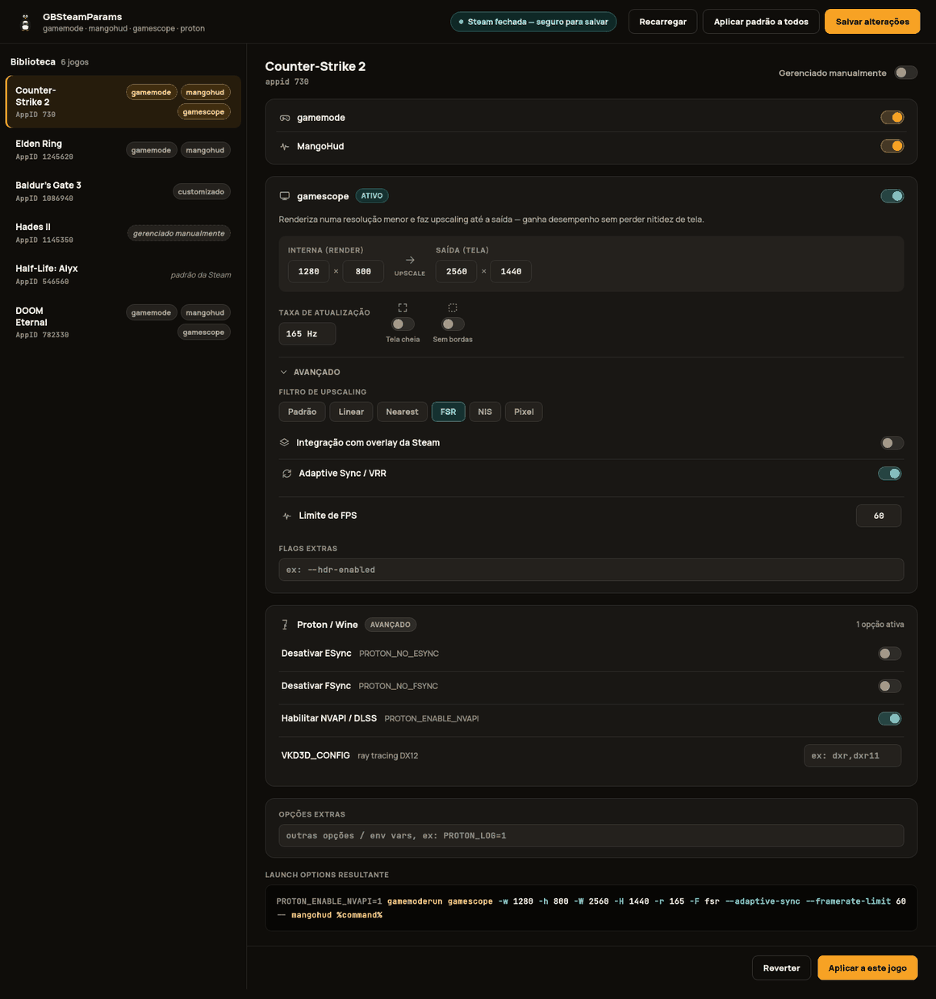

# GBSteamParams

Ferramenta (CLI + app de mesa) para configurar as Launch Options dos jogos
da sua biblioteca Steam sem precisar abrir as propriedades de cada jogo uma
por uma: o CLI aplica **gamemode** + **MangoHud** em massa, e o app gráfico
permite ajustar cada jogo individualmente, incluindo **gamescope**
(resolução interna/saída, upscaling, VRR, limite de FPS) e opções
avançadas de **Proton/Wine** (ESync/FSync, NVAPI/DLSS, VKD3D_CONFIG).

Feito para Linux (testado em Fedora + KDE Plasma), com Steam nativa ou
Flatpak/Snap com pequenas adaptações de caminho.

## O que ele faz

- Lê o `localconfig.vdf` do seu perfil Steam (`~/.local/share/Steam/userdata/<id>/config/`).
- Para cada jogo, garante que a Launch Option tenha `gamemoderun` e `mangohud`
  envolvendo o `%command%`, **preservando** qualquer opção customizada que já
  exista (env vars, flags extras).
- Faz backup automático do arquivo antes de qualquer gravação
  (`localconfig.vdf.bak-<timestamp>`).
- Permite marcar jogos específicos como "gerenciados manualmente" — o
  script nunca mexe neles, útil para jogos com `gamescope` configurado à mão
  na Steam (veja "Sobre o gamescope" abaixo).
- Confere se `gamemode`, `mangohud` e o módulo de kernel `ntsync` estão
  presentes no sistema.

## Estrutura do projeto

```
gbsteamparams/
├── core.py   — parser VDF (KeyValues), montagem/leitura de Launch Options
│               e lista de exclusão. Usado pelo CLI e pela GUI.
├── cli.py    — comando `steam-boost`: aplica gamemode+mangohud em massa.
└── gui.py    — comando `steam-boost-gui`: app de mesa (PySide6/Qt) para
                configurar cada jogo individualmente, incluindo gamescope.
```

## Instalação

Requer Python 3.10+ e PySide6 (para a GUI).

```bash
cd GBSteamParams
python3 -m pip install --user -e .
```

Isso instala dois comandos em `~/.local/bin` (garanta que está no seu `PATH`):

- `steam-boost` — linha de comando
- `steam-boost-gui` — app gráfico

## Uso

### CLI

```bash
steam-boost --dry-run   # mostra o que mudaria, sem gravar nada
steam-boost              # aplica de verdade (pede confirmação se a Steam estiver aberta)
steam-boost --yes         # aplica sem perguntar nada
```

**Importante:** feche a Steam antes de rodar de verdade. Se ela estiver
aberta, pode sobrescrever o arquivo ao ser fechada depois, desfazendo a
mudança.

### App gráfico

```bash
steam-boost-gui
```

- Lista todos os jogos da sua conta à esquerda.
- Selecione um jogo para ver/editar:
  - **gamemode** e **MangoHud** (liga/desliga simples).
  - **gamescope**: resolução interna de render (`-w`/`-h`, upscaling) e de
    saída (`-W`/`-H`), taxa de atualização, filtro de upscaling (linear,
    nearest, FSR, NIS, pixel), tela cheia, sem bordas, integração com
    overlay da Steam (`-e`), Adaptive Sync/VRR e limite de FPS.
  - **Proton / Wine** (avançado): desativar ESync/FSync, habilitar
    NVAPI/DLSS e `VKD3D_CONFIG` (ray tracing DX12).
  - Opções extras livres (outras flags/env vars).
- O preview mostra a string final de Launch Options em tempo real.
- "Aplicar a este jogo" grava a mudança na memória; "Salvar alterações"
  grava no disco (com backup automático). Selecionar outro jogo ou clicar
  em "Salvar alterações" já aplica automaticamente o que estiver no
  painel, então não é preciso clicar em "Aplicar a este jogo" antes.
- "Gerenciado manualmente" tira o jogo da lista de jogos que o
  `steam-boost` (CLI ou botão "aplicar a todos") mexe.



> A imagem acima é um mockup de referência (tema escuro) usado para guiar
> uma futura reorganização visual da GUI — hoje o app ainda usa os
> widgets padrão do Qt/tema do sistema, sem esse estilo customizado.

## Sobre o gamescope

O `gamescope` usa um separador `--`: tudo antes dele configura o próprio
compositor (resolução, tela cheia etc.), tudo depois roda **dentro** dele.
A ordem correta costuma ser:

```
gamemoderun gamescope -W 2560 -H 1440 -f -- mangohud %command%
```

(`gamemoderun` fora, `mangohud` dentro do `--`, senão o overlay não fica
sobre o jogo corretamente). O app gráfico monta essa string corretamente a
partir dos campos estruturados. Já o CLI (`steam-boost`, mesclagem em massa)
**não entende** esse separador — por isso, jogos com gamescope configurado
devem ser marcados como "gerenciado manualmente" (pela GUI, ou adicionando
o appid em `~/.config/steam-boost/exclude.txt`), assim o CLI nunca mexe
neles.

## Sobre o ntsync

`ntsync` é um módulo de kernel (não uma Launch Option). Ele acelera as
primitivas de sincronização do Wine/Proton. Basta estar carregado
(`lsmod | grep ntsync`) e usar uma build de Proton que o suporte (Proton
Experimental, Proton 9+, GE-Proton) — a detecção é automática, feita pelo
próprio Proton via `/dev/ntsync`. No Fedora, o pacote `kernel-modules-core`
já carrega o módulo sozinho no boot.

## Lista de exclusão

Arquivo: `~/.config/steam-boost/exclude.txt` — um appid por linha, `#` para
comentário. Jogos listados aqui nunca são tocados pelo `steam-boost` (CLI
ou botão de aplicação em massa da GUI). É criado automaticamente na
primeira execução.

## Empacotamento (.rpm / .deb / .tar.gz)

O workflow `.github/workflows/release.yml` builda os três formatos a cada
tag `vX.Y.Z` (ou manualmente via "Run workflow"), e anexa tudo numa Release
do GitHub quando é uma tag:

- **tar.gz** — sdist padrão do Python (`python3 -m build --sdist`).
- **.rpm** — via `rpmbuild` num container Fedora, usando
  `packaging/rpm/gbsteamparams.spec`.
- **.deb** — via `dpkg-buildpackage` num container Debian, usando os
  arquivos em `debian/`.

Para gerar localmente (Fedora, precisa de `rpm-build` e
`pyproject-rpm-macros`):

```bash
python3 -m build --sdist --outdir dist
mkdir -p rpmbuild/{SOURCES,SPECS,RPMS,BUILD,SRPMS}
cp dist/*.tar.gz rpmbuild/SOURCES/
cp packaging/rpm/gbsteamparams.spec rpmbuild/SPECS/
rpmbuild --define "_topdir $PWD/rpmbuild" --define "_version 0.1.0" \
  -bb rpmbuild/SPECS/gbsteamparams.spec
```

Licença: MIT (veja `LICENSE`) — ajuste se preferir outra.
